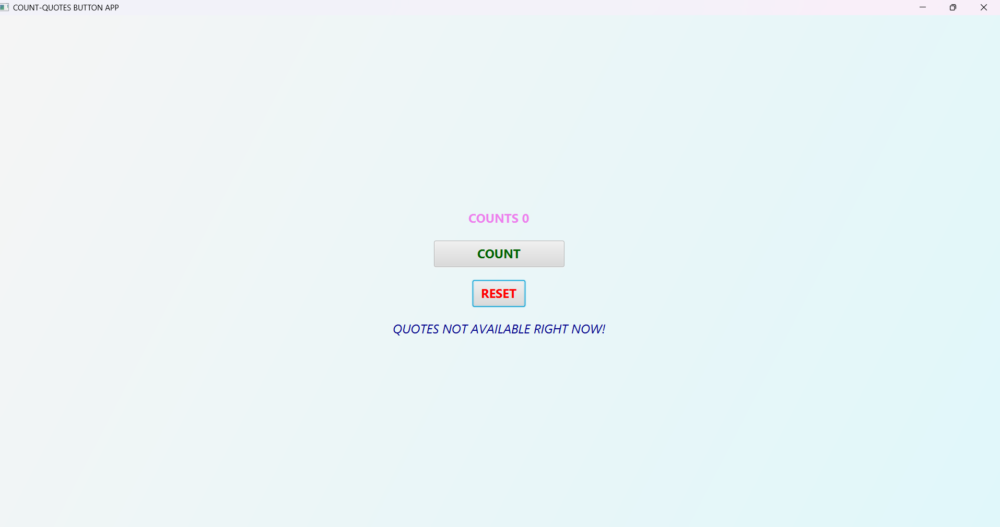
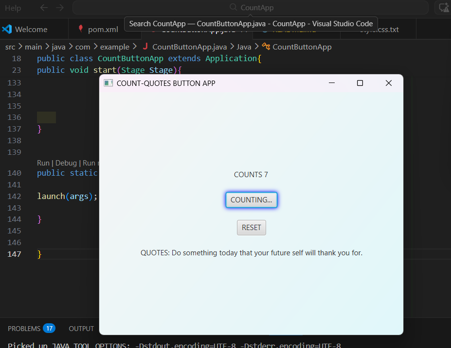
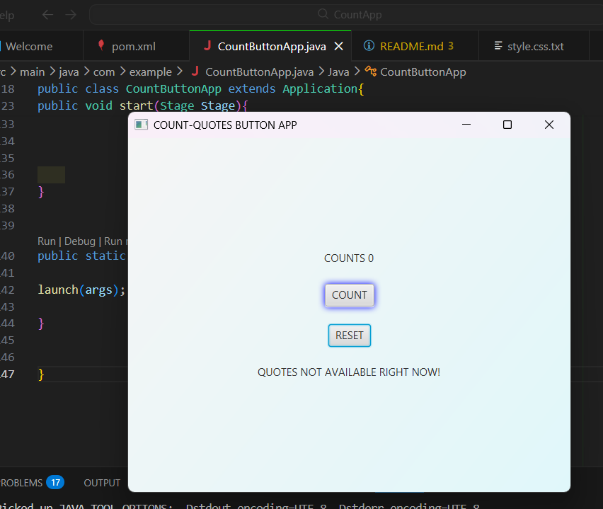

# Count & Quotes Button App


A simple JavaFX app that:
- Counts button clicks 
- Shows random motivational quotes
- Can reset the counter and quote

---

## Features

- **Click Counter**: Increments every time you press the button.
- **Random Quotes**: Displays a new motivational quote each click.
- **Reset Button**: Reset both the counter and the quote.

---

## Screenshots

## Screenshots

Main Window of the App:



Click Counter in Action:



Reset in Action:



---

## Requirements

- Java 17 or higher  
- JavaFX SDK installed  
- Maven installed  

---

## How to Run

1. Clone the repository:  
   ```bash
   git clone https://github.com/hassan200503/CountButtonApp.git```


   ## Author

**Hassan Tsuma Karungwa** ([GitHub](https://github.com/hassan200503))

## License

This project is licensed under the MIT License.
