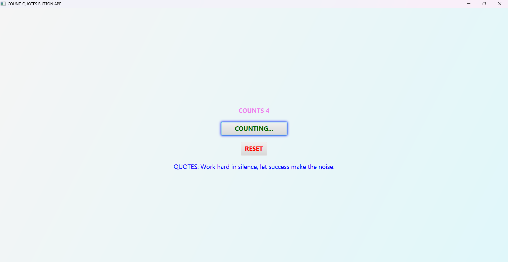
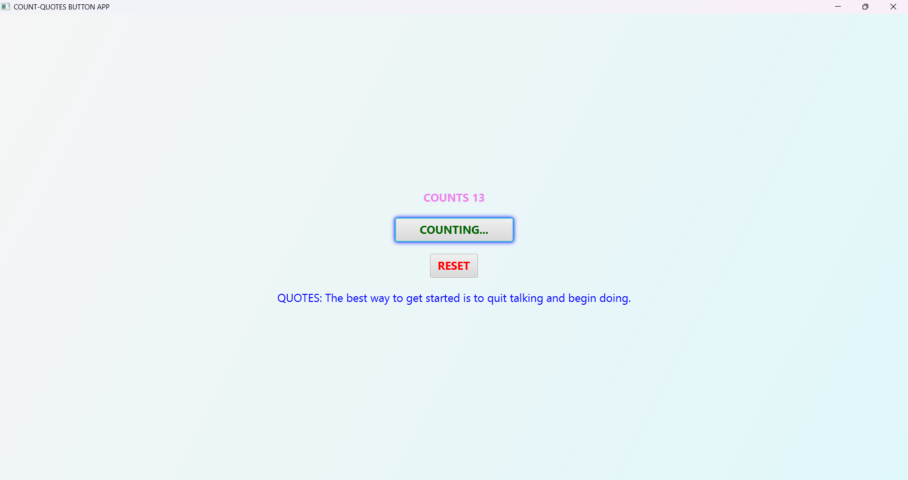

# Count & Quotes Button App

A simple JavaFX app that:

1.  Counts button clicks 
2.  Shows random motivational quotes
3. Can reset the counter and quote

## Features

1.  **Click Counter**: Increments every time you press the button.
2.  **Random Quotes**: Displays a new motivational quote each click.
3.  **Reset Button**: Reset both the counter and the quote.

## Screenshots

## Requirements

1.  Java 17 or higher  
2.  JavaFX SDK installed  
3.  Maven installed  

## How to Run

1. Clone the repository:  
   bash
   git clone https://github.com/hassan200503/CountButtonApp.git

2. Navigate to the folder
   cd CountButtonApp

3. Build and run with mvn

   ## Author

**Hassan Tsuma Karungwa** [GitHub](https://github.com/hassan200503)

**N/B**
This is my first project toward my programming(Java and JavaFX) learning.

**Goal**
Aiming to master well programming and develop 50+ projects.
I want to be a strong problem solver in software development.

